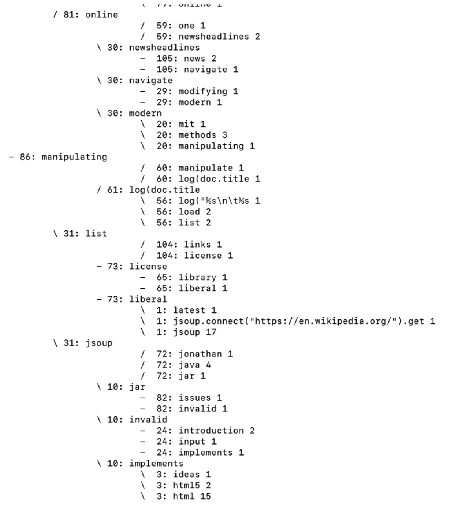

CSCD427 - Advanced Databases

### B+ Tree

In this project, I implemented a **B+ Tree**, a data structure commonly used in database indexing to allow for **efficient searches**, insertions, and deletions. The B+ Tree is a type of self-balancing tree structure that maintains sorted data and provides efficient **range queries** and **lookup operations**.

This project would take a website as input, as well as a .txt file of words to ignore.
The program sorted the words in html file and sorted them into a B+ Tree that is displayed in the command line.
If a duplicate word is found, we increment a word frequency counter associated with each word.

### Key Concepts:
- **B+ Tree**: An extension of the B-Tree, the B+ Tree stores all values in the leaf nodes, which are linked for efficient range queries.
- **Database Indexing**: The B+ Tree is commonly used in databases to create efficient indexes that speed up query performance.
- **Efficient Search and Insertion**: The tree structure allows for logarithmic time complexity for search, insert, and delete operations, which makes it ideal for large-scale datasets.

**Example Output**

Left-most node "manipulating" is the root, with left children "jsoup" and "list".

The values to the left of the words are node IDs, showing what words are part of the same node.

The values to the right of the words are the word frequencies.
